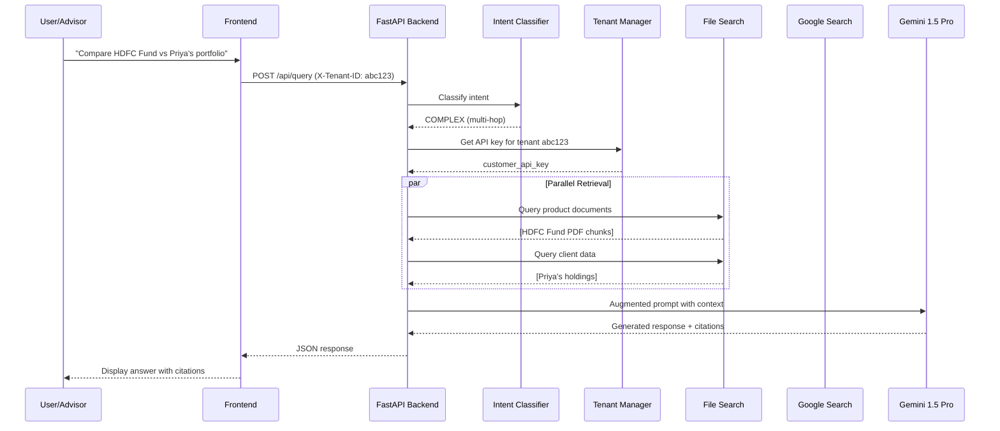
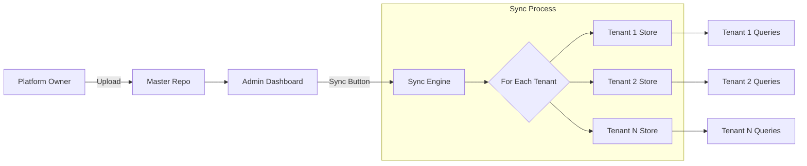
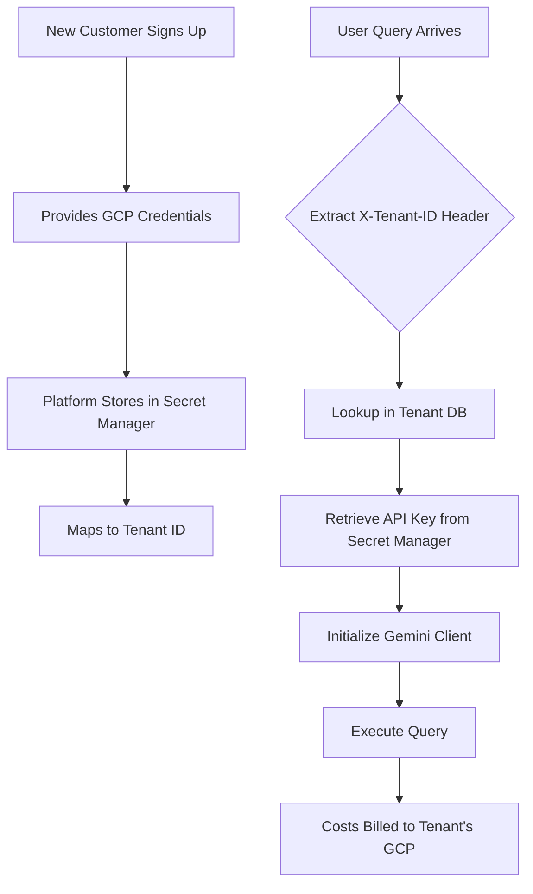
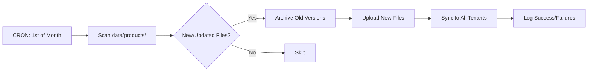
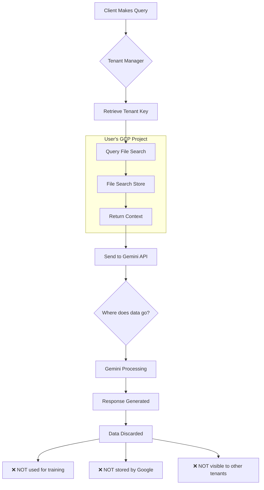

# Financial Advisor AI - Complete System Documentation

> **SaaS Platform for Financial Intermediaries**  
> Multi-tenant RAG-powered AI chatbot with client-specific data isolation

---

## 1. 🎯 What is the whole app about?

**Financial Advisor AI** is a specialized AI chatbot platform designed specifically for financial intermediaries (brokers, advisors, wealth managers) to provide accurate, compliant financial advice to their clients.

### Core Value Proposition
- **Domain-Specific Intelligence**: Unlike generic ChatGPT, this AI is grounded in actual financial product documents
- **Client-Aware Responses**: Integrates with Zoho CRM to access real client portfolio data
- **Cost-Efficient Model**: Pay-as-you-go pricing where advisors control their AI costs
- **Data Sovereignty**: Each customer owns their data in their own GCP project

### Key Components
```
┌─────────────────────────────────────────┐
│  Platform Owner (You)                   │
│  - Hosts core application               │
│  - Manages shared product documents     │
│  - Provides sync infrastructure         │
└─────────────────────────────────────────┘
              │
              ├───────┬───────┬───────┐
              ▼       ▼       ▼       ▼
         Customer Customer Customer Customer
         (Tenant)  (Tenant)  (Tenant)  (Tenant)
         ┌──────────────────────────┐
         │ Own GCP Project          │
         │ - Gemini API Key         │
         │ - File Search Store      │
         │ - Client Data            │
         └──────────────────────────┘
```

### What Problems Does It Solve?
1. **Hallucination**: ChatGPT makes up features about financial products
2. **Outdated Info**: Generic models don't know about policies launched last month
3. **No Context**: Traditional AI doesn't know "Priya has ₹5L in HDFC Top 100"
4. **Privacy Concerns**: Entering client data into public ChatGPT violates regulations

---

## 2. 🔄 How does querying work? (Visual Flow)

### User Query Journey



### Detailed Processing Steps

#### Step 1: Intent Classification
```python
Query: "What is HDFC Multi Asset Fund?"
↓
Gemini Flash (fast/cheap) analyzes:
- Mentions product name? ✓
- Asks about client? ✗
- Needs external search? ✗
↓
Classification: PRODUCT
```

#### Step 2: Context Retrieval
```python
if intent == PRODUCT:
    context = FileSearchStore.query(
        store_name="products-tenant-abc",
        query="HDFC Multi Asset Fund features"
    )
    # Returns: [chunk1.pdf, chunk2.pdf, ...]
```

#### Step 3: Response Generation
```python
prompt = f"""
Answer this query using ONLY the provided context.

Context:
{context_chunks}

Query: {user_query}

Cite your sources.
"""

response = Gemini_Pro.generate(prompt)
```

---

## 3. 🧠 How does Intent Classification work?

### Classification System

The system uses a **two-stage classification**:

#### Stage 1: LLM-Based Classification
```python
CLASSIFICATION_PROMPT = """
Analyze this query and classify into ONE category:

1. PRODUCT: Questions about specific financial products
   Examples:
   - "What is HDFC Top 100 fund?"
   - "Show me term insurance from ICICI"

2. CLIENT: Questions about specific client portfolios
   Examples:
   - "What is Priya's current NAV?"
   - "Show Rahul's holdings"

3. COMPLEX: Comparisons or multi-step queries
   Examples:
   - "Compare Acko health with client Priya's current policy"
   - "Which mutual fund is better for tax saving?"

4. GENERAL: Generic financial concepts
   Examples:
   - "What is ELSS?"
   - "Explain term insurance"

Return JSON: {"intent": "...", "confidence": 0.0-1.0, "entities": {...}}
"""
```

#### Stage 2: Context-Aware Override
```python
def get_context_aware_intent(intent, conversation_history):
    # Check recent context
    if last_query_was_about_client and current_query_says_"this":
        return CLIENT  # "this" refers to client
    
    # Check for external comparisons
    if mentions_multiple_companies and one_not_in_our_store:
        return COMPLEX  # needs Google Search
    
    return intent  # keep original
```

### Why This Matters
- **Cost Optimization**: General queries don't trigger expensive File Search
- **Accuracy**: Right data source for right query
- **Speed**: Simple queries bypass RAG pipeline

---

## 4. 📚 What data is in the RAG?

### Data Architecture

```
File Search Stores (Vertex AI)
│
├── Shared Knowledge Store (One per customer)
│   ├── Insurance/
│   │   ├── Health Insurance/
│   │   │   ├── Acko_Personal_Health_Policy.pdf
│   │   │   ├── Star_Health_Premier.pdf
│   │   │   └── HDFC_Ergo_Optima_Secure.pdf
│   │   ├── Life Insurance/
│   │   │   ├── ICICI_iProtect_Smart.pdf
│   │   │   └── Tata_AIA_Life_Insurance.pdf
│   │   └── Motor Insurance/
│   │       └── Bajaj_Allianz_Motor.pdf
│   ├── Mutual Funds/
│   │   ├── HDFC/
│   │   │   ├── HDFC_Top_100.pdf
│   │   │   ├── HDFC_Multi_Asset.pdf
│   │   │   └── HDFC_Tax_Saver.pdf
│   │   ├── SBI/
│   │   ├── ICICI/
│   │   └── Axis/
│   └── Stocks/
│       ├── Research_Reports/
│       └── Company_Analysis/
│
└── Client Data Store (Customer-specific, synced from Zoho)
    ├── client_priya_holdings.txt
    ├── client_rahul_portfolio.txt
    └── client_anil_transactions.txt
```

### Data Format Examples

#### Product Document (HDFC Multi Asset Fund)
```
Original: HDFC_Multi_Asset_Fund.pdf (47 pages)
↓
Chunked into 94 segments
↓
Each chunk = ~400 tokens
↓
Embedded with text-embedding-004 model
↓
Stored in Vertex AI vector database
```

#### Client Data (from Zoho)
```json
{
  "client_name": "Priya Sharma",
  "portfolio": [
    {
      "scheme": "HDFC Top 100",
      "units": 523.45,
      "nav": 687.23,
      "current_value": 359678.90
    }
  ]
}
↓ Transformed to ↓
"Priya Sharma holds 523.45 units of HDFC Top 100 Fund with NAV ₹687.23, current value ₹3,59,678.90"
```

### Current Data Volume
- **Documents**: ~1,300 files
- **Total Size**: ~2.4 GB
- **Categories**: 15+ product categories
- **Supported Formats**: PDF, Markdown, TXT

---

## 5. ⚡ Why Better than ChatGPT / Vanilla Gemini?

### Comparison Matrix

| Aspect | Financial Advisor AI | ChatGPT 4 | Gemini Pro (Web Search) |
|:---|:---|:---|:---|
| **Data Freshness** | ✅ Real-time (upload today, query today) | ❌ Training cutoff (months old) | ⚠️ Web search may find ads/spam |
| **Accuracy** | ✅ 100% from your documents | ❌ Hallucinates missing details | ⚠️ Trusts unreliable websites |
| **Citations** | ✅ Exact PDF + page number | ❌ No source citations | ⚠️ Generic web links |
| **Client Context** | ✅ Knows "Priya's portfolio" | ❌ No memory of your clients | ❌ Can't integrate CRM |
| **Privacy** | ✅ Data in your GCP project | ⚠️ May train on your data (non-Enterprise) | ⚠️ Searches public web |
| **Cost** | ✅ $0.35 / 1M tokens | ❌ $10-60 / 1M tokens | ⚠️ $1.25 / 1M tokens + grounding fees |
| **Compliance** | ✅ SEBI/IRDAI document-backed | ❌ Generic "not financial advice" | ❌ Unverified sources |

### Real Example Comparison

**Query**: "What is the claim settlement ratio of Acko health policy?"

#### ChatGPT Response:
```
"Acko Health Insurance typically has a claim settlement 
ratio in the range of 85-90% based on industry standards..."
```
❌ **Problem**: No source, could be outdated or wrong

#### Gemini Web Search Response:
```
"According to various sources, Acko has a claim settlement 
ratio of approximately 88.5%..."
[source: insuranceupdates.blogspot.com]
```
❌ **Problem**: Unreliable blog, not official data

#### Financial Advisor AI Response:
```
"The claim settlement ratio is not explicitly mentioned in 
the Acko Personal Health Policy document. However, the policy 
document states that claims are processed within 30 days..."

📄 Source: Policy_Wordings_Acko_Personal_Health_Policy.pdf, Page 12
```
✅ **Accurate**: Only claims what's in the official document

---

## 6. 💰 End-to-End Costing Model

### Revenue & Cost Breakdown

#### Platform Owner (You)
```
Revenue:
├── Setup Fee: ₹50,000 per customer (one-time)
├── AMC: ₹2,000/month per customer
└── Total (10 customers): ₹7,00,000 + ₹2,40,000/year

Costs:
├── Cloud Hosting: ₹8,000/month (AWS/GCP)
├── Development: ₹0 (already built)
└── Document Updates: ₹5,000/month (manual curation)

Profit: ~₹2,15,000/year (for 10 customers)
```

#### Financial Advisor (End User)
```
Costs:
├── Platform Fee to You: ₹50,000 (setup) + ₹2,000/month
├── Google AI Usage (direct billing):
│   ├── Gemini Flash: ~₹200/month (500 queries/day)
│   ├── Gemini Pro: ~₹800/month (generation)
│   ├── File Search Storage: ₹0 (covered by free credit)
│   └── Google Search Grounding: ~₹300/month
└── Total First Year: ₹50,000 + (₹2,000 + ₹1,300) × 12 = ₹89,600

Value Delivered:
├── Time Saved: 10 hours/week = ₹2,00,000/year
├── Client Retention: Better service = +15% revenue
└── ROI: >300%
```

### Cost Per Query Breakdown
```
Typical Product Query:
├── Intent Classification (Flash): ₹0.0003
├── File Search (retrieval): ₹0.002
├── Response Generation (Pro): ₹0.012
└── Total: ₹0.0143 (~1.4 paise)

Complex Query with Google Search:
├── Intent Classification: ₹0.0003
├── File Search: ₹0.002
├── Google Grounding: ₹0.035
├── Response Generation: ₹0.015
└── Total: ₹0.0523 (~5.2 paise)
```

---

## 7. 🔄 How to Replicate Common RAG for Each Customer?

### Master-to-Tenant Sync Architecture



### Step-by-Step Process

#### 1. Upload New Document
```bash
# Via Admin Dashboard
POST /admin/documents/upload
{
  "file": "HDFC_New_Fund_Jan2024.pdf",
  "category": "Mutual Funds/HDFC"
}
```

#### 2. Trigger Sync
```bash
# Option A: Sync to all customers
POST /admin/sync/all

# Option B: Sync to specific customer
POST /admin/sync/customer/tenant_abc123
```

#### 3. Backend Process
```python
async def sync_docs_to_all_customers():
    customers = get_all_active_customers()
    
    for customer in customers:
        # Get customer's API key
        api_key = get_tenant_api_key(customer.id)
        
        # Initialize client with their key
        client = genai.Client(api_key=api_key)
        
        # Upload to their store
        for doc in get_new_documents():
            client.file_search_stores.upload_to_file_search_store(
                file=doc.path,
                file_search_store_name=customer.store_name,
                config={'display_name': f"{doc.category} - {doc.filename}"}
            )
```

#### 4. Result
- **Tenant 1**: Has HDFC_New_Fund_Jan2024.pdf (billed to their GCP)
- **Tenant 2**: Has HDFC_New_Fund_Jan2024.pdf (billed to their GCP)
- **Tenant N**: Has HDFC_New_Fund_Jan2024.pdf (billed to their GCP)

### Why This Works
- **Isolation**: Each tenant has a physical copy in their own GCP project
- **Billing**: Upload costs are billed to each tenant's account
- **Independence**: If one tenant leaves, others are unaffected

---

## 8. 🔐 Separate API Key Process for Each Customer

### Multi-Tenancy Key Management



### Implementation

#### Step 1: Customer Onboarding
```python
# Admin Interface
@router.post("/admin/customers")
async def add_customer(
    name: str,
    gemini_api_key: str,
    zoho_credentials: dict
):
    # Store in database
    customer = {
        "id": "tenant_abc123",
        "name": name,
        "created_at": datetime.utcnow()
    }
    
    # Store sensitive keys in Secret Manager
    store_secret(f"gemini_key_{customer.id}", gemini_api_key)
    store_secret(f"zoho_creds_{customer.id}", zoho_credentials)
    
    # Create File Search Store (using their key)
    client = genai.Client(api_key=gemini_api_key)
    store = client.file_search_stores.create(
        display_name=f"products-{name}"
    )
    
    customer["store_name"] = store.name
    return customer
```

#### Step 2: Runtime Key Retrieval
```python
class TenantManager:
    def get_client(self, tenant_id: str):
        # Retrieve from Secret Manager
        api_key = get_secret(f"gemini_key_{tenant_id}")
        
        # Initialize client
        return genai.Client(api_key=api_key)

# Usage in API
@app.post("/api/query")
async def query(
    request: QueryRequest,
    tenant_id: str = Header(None, alias="X-Tenant-ID")
):
    client = tenant_manager.get_client(tenant_id)
    # All costs now billed to THIS tenant
```

#### Step 3: Billing Flow
```
User (Tenant ABC) makes query
↓
Request uses tenant_abc_api_key
↓
Gemini API call → GCP Project "tenant-abc-gcp-project"
↓
Billing at end of month:
  GCP bill to tenant-abc@gmail.com
  ├── Gemini API: $12.45
  ├── File Search: $3.20
  └── Total: $15.65
```

---

## 9. 📅 Monthly Update of Embeddings

### Automated Update Pipeline



### Implementation

#### Schedule Setup
```python
# Using APScheduler
from apscheduler.schedulers.asyncio import AsyncIOScheduler

scheduler = AsyncIOScheduler()

@scheduler.scheduled_job('cron', day=1, hour=2)  # 1st of month, 2 AM
async def monthly_product_sync():
    logger.info("Starting monthly product document sync")
    
    # Find new/updated documents
    new_docs = find_updated_documents(
        since=datetime.now() - timedelta(days=30)
    )
    
    if not new_docs:
        logger.info("No new documents to sync")
        return
    
    # Sync to all tenants
    results = await sync_documents_to_all_tenants(new_docs)
    
    # Send report
    send_admin_email(f"Synced {len(new_docs)} docs to {results['success']} tenants")
```

#### Document Versioning
```python
def archive_old_version(file_search_store, document_name):
    """Mark old version as archived before uploading new one"""
    
    # List existing files
    existing = client.file_search_stores.list_files(store_name)
    
    for file in existing:
        if file.display_name == document_name:
            # Rename to indicate archived
            client.files.update(
                file.name,
                display_name=f"[ARCHIVED-{datetime.now().strftime('%Y%m')}] {document_name}"
            )
```

### Key Points
- **No Manual Embeddings**: Vertex AI automatically re-indexes on upload
- **Processing Time**: Typically 5-30 seconds per document
- **Zero Downtime**: Old version serves queries until new one is ready
- **Version Control**: Archived versions remain queryable if needed

---

## 10. 🔄 Batch Job: Zoho Weekly Update & Customer Embeddings

### Two-Part Sync System

#### Part A: Product Document Sync (All Customers)
```python
@scheduler.scheduled_job('cron', day_of_week='sun', hour=3)
async def weekly_product_sync():
    """Sync shared product documents to all tenants"""
    
    customers = get_all_active_customers()
    
    for customer in customers:
        try:
            api_key = get_tenant_api_key(customer.id)
            client = genai.Client(api_key=api_key)
            
            # Upload new documents to their store
            new_docs = get_documents_added_this_week()
            for doc in new_docs:
                client.file_search_stores.upload_to_file_search_store(
                    file=doc.path,
                    file_search_store_name=customer.store_name
                )
            
            log_sync_success(customer.id, len(new_docs))
        except Exception as e:
            log_sync_failure(customer.id, str(e))
```

#### Part B: Zoho Client Data Sync (Per Customer)
```python
@scheduler.scheduled_job('cron', day_of_week='mon', hour=1)
async def weekly_zoho_sync():
    """Sync client data from Zoho CRM for each tenant"""
    
    customers = get_customers_with_zoho_enabled()
    
    for customer in customers:
        # Get Zoho credentials
        zoho_creds = get_secret(f"zoho_creds_{customer.id}")
        
        # Fetch client data
        zoho_client = ZohoClient(zoho_creds)
        clients = zoho_client.get_all_contacts()
        
        # Transform to LLM-friendly format
        llm_documents = []
        for client in clients:
            text = f"""
            Client: {client.name}
            Portfolio:
            - {client.scheme_name}: {client.units} units @ NAV ₹{client.nav}
            - Current Value: ₹{client.current_value}
            - Last Updated: {client.last_transaction_date}
            """
            llm_documents.append(text)
        
        # Delete old client data files
        delete_old_client_files(customer.store_name)
        
        # Upload new client data
        for i, doc_text in enumerate(llm_documents):
            temp_file = f"/tmp/client_data_{i}.txt"
            with open(temp_file, 'w') as f:
                f.write(doc_text)
            
            upload_to_file_search(customer.store_name, temp_file)
```

### Sync Schedule

| Job | Frequency | Time | Purpose |
|:---|:---|:---|:---|
| **Product Sync** | Weekly | Sunday 3 AM | Push new mutual fund/insurance docs |
| **Zoho Sync** | Weekly | Monday 1 AM | Update client portfolios |
| **Monthly Cleanup** | Monthly | 1st, 4 AM | Archive old documents |

---

## 11. 🛠️ Product vs. Service Model

### Why This is More Service Than Product

#### Traditional Product Model
```
SaaS Product:
├── User pays subscription
├── Company hosts everything
├── Same features for everyone
└── Company bears all infrastructure costs
```

#### This Service Model
```
AI Infrastructure Service:
├── User pays for YOUR expertise/curation
├── User hosts their own AI (GCP)
├── Custom features per tenant
└── User controls their costs
```

### Service Components

#### 1. **Data Curation Service** (Your Core Value)
```
You provide:
├── Curated financial product library
│   ├── Verified HDFC fund documents
│   ├── Authentic ICICI policy wordings
│   └── Regulatory-compliant data
├── Document updates (monthly)
└── Quality assurance
```
**Why customers pay**: They can't build this curation themselves

#### 2. **Integration Service**
```
You provide:
├── Zoho CRM connector
├── Automatic sync pipelines
├── Data transformation logic
└── Error handling/retry mechanisms
```
**Why customers pay**: Complex integration expertise

#### 3. **Prompt Engineering Service**
```
You provide:
├── Optimized classification prompts
├── Context assembly logic
├── Response formatting
└── Continuous A/B testing
```
**Why customers pay**: AI expertise they lack

#### 4. **Maintenance Service**
```
You provide:
├── Bug fixes
├── Security updates
├── Feature enhancements
└── 24/7 monitoring
```

### Stickiness Factor
Customers stay because:
1. **Data Network Effect**: Your product library gets better every month
2. **Integration Lock-in**: Moving means rebuilding Zoho connectors
3. **Prompt IP**: Your classification logic is proprietary
4. **Inertia**: "It just works" is hard to replace

---

## 12. 🛡️ Data Protection for Zoho Customers

### Multi-Layer Privacy Architecture

```
┌─────────────────────────────────────────┐
│  Layer 1: Physical Isolation            │
│  Each tenant = Separate GCP Project     │
└─────────────────────────────────────────┘
              ↓
┌─────────────────────────────────────────┐
│  Layer 2: API Key Segregation           │
│  Tenant A key ≠ Tenant B key            │
└─────────────────────────────────────────┘
              ↓
┌─────────────────────────────────────────┐
│  Layer 3: Application-Level Access      │
│  TenantManager validates every request  │
└─────────────────────────────────────────┘
              ↓
┌─────────────────────────────────────────┐
│  Layer 4: Encryption                    │
│  TLS 1.3 in transit, AES-256 at rest    │
└─────────────────────────────────────────┘
```

### Regulatory Compliance

#### DPDP Act (India)
✅ **Data Localization**: Tenant can choose `asia-south1` region  
✅ **Right to Deletion**: Delete tenant = instant data wipe  
✅ **Consent**: Advisors get client consent before Zoho integration  
✅ **Purpose Limitation**: Data only used for portfolio queries

#### SEBI RIA Regulations
✅ **Record Keeping**: All queries logged with tenant ID  
✅ **Audit Trail**: Citations show which document was used  
✅ **No Commissions**: System doesn't recommend products, only explains

### Attack Surface Analysis

| Threat | Mitigation |
|:---|:---|
| **Cross-Tenant Data Leak** | Impossible: Different GCP projects |
| **API Key Theft** | Stored in Secret Manager, rotated quarterly |
| **Zoho Credential Exposure** | OAuth tokens, not passwords |
| **Man-in-the-Middle** | TLS 1.3 + certificate pinning |
| **Insider Threat** | Platform owner has NO access to tenant keys |

---

## 13. 🔒 Privacy Considerations with Our Model

### Data Flow Privacy



### Privacy Guarantees

#### 1. **No Model Training on Your Data**
```
Commercial Gemini API:
├── Does NOT train on customer data
├── Does NOT retain prompts after response
└── Uses data ONLY for that single request

vs.

Free ChatGPT:
├── MAY use data for training (unless opt-out)
├── Stores conversation history
└── No data sovereignty guarantees
```

#### 2. **Data Residency Control**
```python
# Tenant can specify their region
customer = {
    "id": "tenant_india123",
    "gcp_region": "asia-south1",  # India
    "data_residency": "IN"
}

# All File Search operations happen in that region
client.file_search_stores.create(
    display_name="products-india",
    config={'location': 'asia-south1'}
)
```

#### 3. **Ephemeral Processing**
```
Query Lifecycle:
├── T=0s: Query received
├── T=1s: Context retrieved from File Search
├── T=2s: Sent to Gemini API
├── T=3s: Response generated
├── T=4s: Context DISCARDED from memory
└── T=5s: Only response returned (no context stored)
```

#### 4. **Access Audit Logs**
```python
# Every query is logged
{
    "timestamp": "2024-01-15T10:30:00Z",
    "tenant_id": "tenant_abc",
    "query_hash": "sha256(...)",  # NOT full query
    "intent": "PRODUCT",
    "documents_accessed": [
        "HDFC_Top_100.pdf",
        "ICICI_BluechipFund.pdf"
    ],
    "user_ip": "203.0.113.45"
}
```

### Client Data in Zoho Sync

#### Privacy-Preserving Transformation
```python
# Original Zoho Data (stored in Tenant's Zoho)
{
    "contact_id": "123456789",
    "name": "Priya Sharma",
    "phone": "+91-9876543210",
    "email": "priya@email.com",
    "pan": "ABCDE1234F",
    "holdings": [...]
}

# Synced to File Search (PII minimized)
"""
Client Priya (ID: PS001) holds:
- HDFC Top 100: 500 units @ ₹687.23 NAV
- Current Value: ₹3,43,615
Last updated: 2024-01-10
"""
# Note: Phone, Email, PAN are NOT synced
```

### Compliance Checklist

| Requirement | Status | Implementation |
|:---|:---|:---|
| **Data Encryption** | ✅ | TLS 1.3 + AES-256 |
| **Access Logging** | ✅ | Every query logged |
| **Data Minimization** | ✅ | Only relevant fields synced |
| **Right to Erasure** | ✅ | Delete tenant = wipe all data |
| **Consent Management** | ⚠️ | Advisor must obtain client consent |
| **Data Portability** | ✅ | Export via File Search API |
| **Breach Notification** | ⚠️ | Manual process (add automation) |

---

## 🎯 Summary

This Financial Advisor AI platform is a **privacy-first, cost-efficient, and compliant** solution that combines:
- **RAG accuracy** (grounded in real documents)
- **Multi-tenant isolation** (each customer owns their data)
- **Pay-as-you-go pricing** (fair cost distribution)
- **Service-based stickiness** (ongoing value from curation)

It's designed for financial intermediaries who need AI but can't risk hallucinations, privacy violations, or vendor lock-in.
