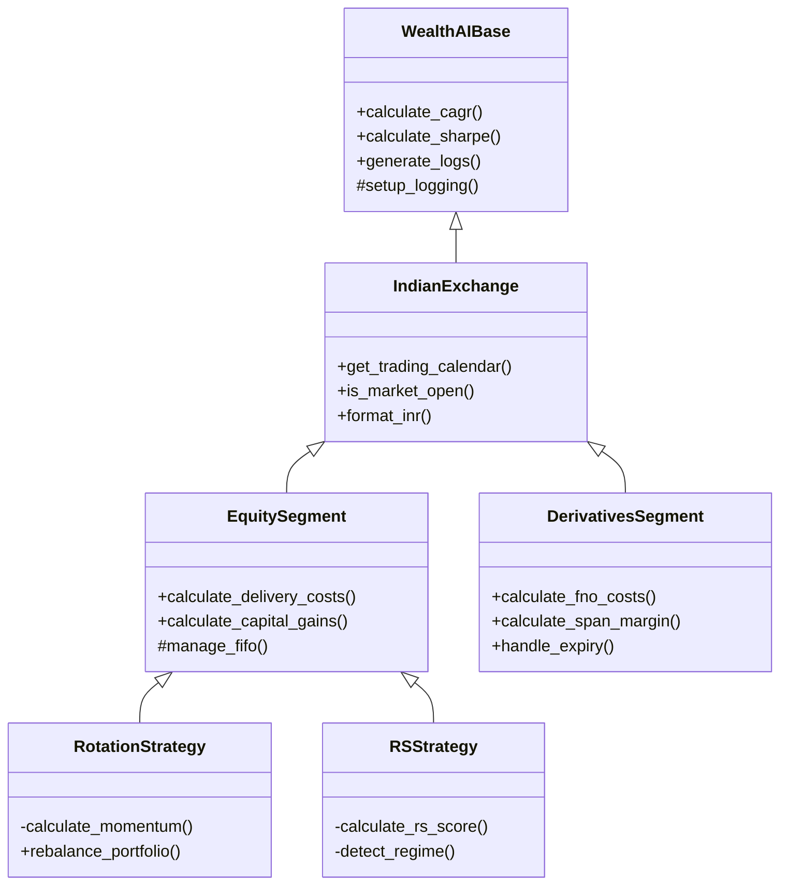
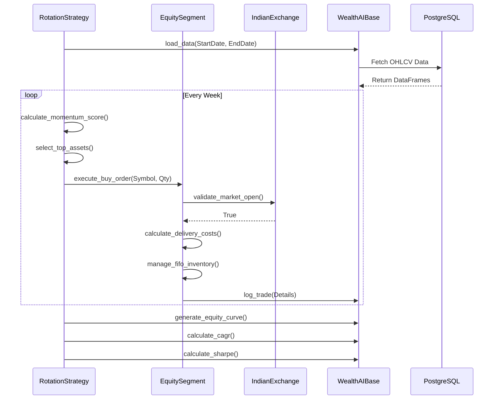

# WealthAI Technical Specification: Indian Market Architecture

## 📚 Executive Summary
This document outlines the technical architecture for the WealthAI backend, specifically tailored for the Indian Financial Market (NSE/BSE). It defines a strict hierarchical class structure designed for scalability, maintainability, and precise Indian market compliance.

## 🏗️ Class Hierarchy Overview

The architecture follows a 4-tier inheritance model:

1.  **Level 1: Core Foundation** (`WealthAIBase`)
    *   *Purpose:* Universal logic applicable to any trading system.
2.  **Level 2: Exchange Layer** (`IndianExchange`)
    *   *Purpose:* Logic specific to Indian exchanges (NSE/BSE).
3.  **Level 3: Segment Layer** (`EquitySegment`, `DerivativesSegment`)
    *   *Purpose:* Logic specific to the asset class (Equity vs F&O).
4.  **Level 4: Strategy Implementation** (`RotationStrategy`, `RSStrategy`)
    *   *Purpose:* The specific trading rules and signals.

---

## 📐 Detailed Class Specifications

### 1. Level 1: WealthAIBase (Abstract)
**File:** `CoreLogic/WealthAIBase.py`
**Role:** The absolute foundation. Handles data, logging, and math.

| Function Name | Visibility | Description |
| :--- | :--- | :--- |
| `__init__` | Public | Initializes logging, database connections, and empty portfolio containers. |
| `setup_logging` | Protected | Configures the standardized logging format for WealthAI. |
| `get_db_session` | Protected | Manages the PostgreSQL database session lifecycle. |
| `load_data` | **Abstract** | *Must be implemented by child.* Defines how to fetch OHLCV data. |
| `calculate_cagr` | Public | Computes Compound Annual Growth Rate. |
| `calculate_sharpe_ratio` | Public | Computes risk-adjusted returns (Sharpe). |
| `calculate_max_drawdown` | Public | Computes the maximum peak-to-valley loss. |
| `calculate_volatility` | Public | Computes annualized volatility. |
| `generate_trade_log` | Public | Formats the list of executed trades into a standard dictionary. |
| `generate_equity_curve` | Public | Creates the daily/weekly NAV series for charting. |

### 2. Level 2: IndianExchange
**File:** `CoreLogic/IndianExchange.py`
**Inherits:** `WealthAIBase`
**Role:** Enforces Indian market rules (Trading hours, Holidays, Currency).

| Function Name | Visibility | Description |
| :--- | :--- | :--- |
| `get_trading_calendar` | Public | Returns valid NSE/BSE trading days (excludes weekends/holidays). |
| `is_market_open` | Public | Checks if a timestamp is within 09:15 - 15:30 IST. |
| `format_currency_inr` | Public | Formats numbers to Indian Lakhs/Crores (e.g., ₹1,50,000). |
| `get_risk_free_rate` | Public | Returns the current Indian 10Y Bond Yield (default 7.0%). |
| `validate_symbol_nse` | Protected | Checks if a symbol follows NSE naming conventions (e.g., RELIANCE.NS). |

### 3. Level 3: Segment Implementations

#### A. EquitySegment
**File:** `CoreLogic/Segments/EquitySegment.py`
**Inherits:** `IndianExchange`
**Role:** Handles Delivery-based Equity trading (Stocks & ETFs).

| Function Name | Visibility | Description |
| :--- | :--- | :--- |
| `calculate_delivery_costs` | Public | Uses `IndianMarketCostCalculator`. Includes STT, Stamp Duty, GST for Delivery. |
| `calculate_capital_gains` | Public | Uses `IndianCapitalGainsTaxCalculator`. Handles FIFO, STCG (15%), LTCG (12.5%). |
| `manage_fifo_inventory` | Protected | Tracks buy lots (date, price, qty) to accurately calculate tax upon selling. |
| `apply_corporate_actions` | Public | Adjusts price/quantity for Splits and Bonuses (Placeholder for future). |
| `validate_delivery_rules` | Protected | Ensures T+1 settlement logic (cash availability). |

#### B. DerivativesSegment (Future/Placeholder)
**File:** `CoreLogic/Segments/DerivativesSegment.py`
**Inherits:** `IndianExchange`
**Role:** Handles F&O trading (Futures & Options).

| Function Name | Visibility | Description |
| :--- | :--- | :--- |
| `calculate_fno_costs` | Public | Uses `IndianMarketCostCalculator`. Includes STT on Sell only, higher Turnover charges. |
| `calculate_span_margin` | Public | Calculates required initial margin (Span + Exposure). |
| `mark_to_market` | Public | Daily cash settlement of profits/losses. |
| `handle_expiry` | Public | Auto-squares off positions on the last Thursday of the month. |

### 4. Level 4: Strategy Implementations (The "Brains")

#### A. RotationStrategy (For Stocks & ETFs)
**File:** `Strategies/Rotation/RotationStrategy.py`
**Inherits:** `EquitySegment`
 nvb   
| Function Name | Visibility | Description |
| :--- | :--- | :--- |
| `calculate_momentum_score` | Private | Computes distance from 52-week high/low. |
| `select_top_assets` | Private | Ranks assets and picks the top N based on momentum. |
| `rebalance_portfolio` | Public | Weekly logic: Sell losers, Buy winners to match target weights. |
| `run_backtest` | Public | The main loop: Iterates through dates, calls rebalance, logs trades. |

#### B. RSStrategy (Relative Strength)
**File:** `Strategies/RS/RSStrategy.py`
**Inherits:** `EquitySegment`

| Function Name | Visibility | Description |
| :--- | :--- | :--- |
| `calculate_rs_score` | Private | Computes Mansfield Relative Strength vs Nifty 50. |
| `detect_market_regime` | Private | Determines if market is Bullish, Bearish, or Sideways. |
| `apply_dynamic_stops` | Private | Calculates trailing stop-loss levels based on volatility (ATR). |
| `run_backtest` | Public | The main loop: Checks RS conditions, executes entries/exits. |

---

## 📊 Architecture Diagrams

### 1. Inheritance Hierarchy

### 2. Execution Flow (Data Pipeline)

## 📝 Naming Conventions Summary

*   **Base Class:** `WealthAIBase` (e.g., `WealthAIBase`)
*   **Exchange Layer:** `[Region]Exchange` (e.g., `IndianExchange`)
*   **Segment Layer:** `[AssetType]Segment` (e.g., `EquitySegment`)
*   **Strategy Layer:** `[Name]Strategy` (e.g., `RotationStrategy`)
*   **Variables:** `snake_case` (e.g., `current_market_price`)
*   **Classes:** `PascalCase` (e.g., `IndianMarketCostCalculator`)
*   **Constants:** `UPPER_CASE` (e.g., `NSE_TRADING_START_TIME`)

This specification ensures that the WealthAI backend is robust, strictly typed for the Indian market, and ready for future expansion into F&O or other segments without rewriting core logic.
